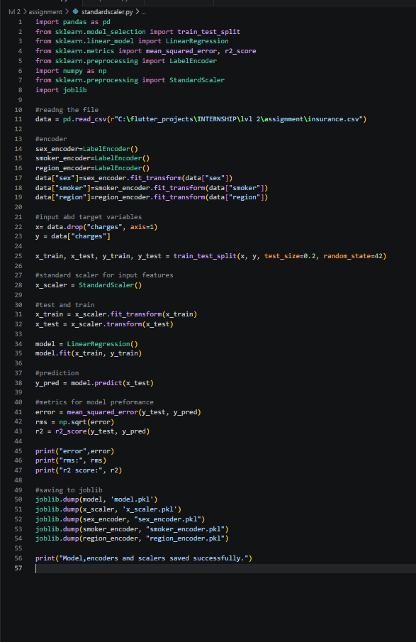
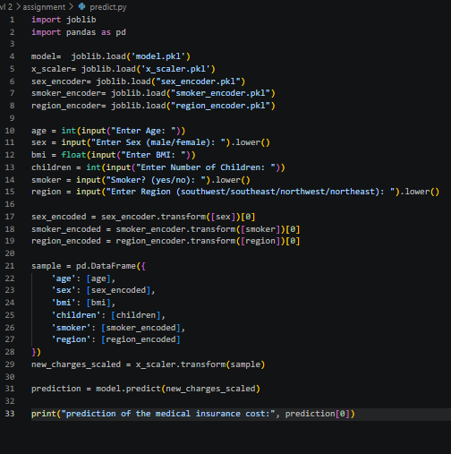
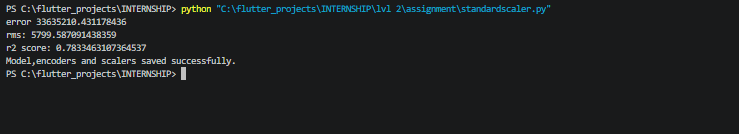
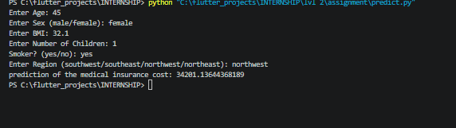

# assignment1-standard-scaler
Level 2 assignment 1 about Standard Scaler by Mithra Nandhana B A

## Problem Statement
Develop a Machine Learning Regression model to predict a person’s medical insurance charges using the Insurance Dataset.

## Answer
The code is saved in the `assignment1-standard-scale/` along with the csv file and pkl files containing the data.

The code and the output are given below.

## *Code*

## *Output*
**program output**

**predict output**

## Final Answer
*program output*
error 33635210.431178436
rms: 5799.587091438359
r2 score: 0.7833463107364537
Model,encoders and scalers saved successfully.

*predict output*
Enter Age: 45
Enter Sex (male/female): female
Enter BMI: 32.1
Enter Number of Children: 1
Smoker? (yes/no): yes
Enter Region (southwest/southeast/northwest/northeast): northwest
prediction of the medical insurance cost: 34201.13644368189

# What I Learned
By this assignment and class, I learned:
1. standard scalers

:D
